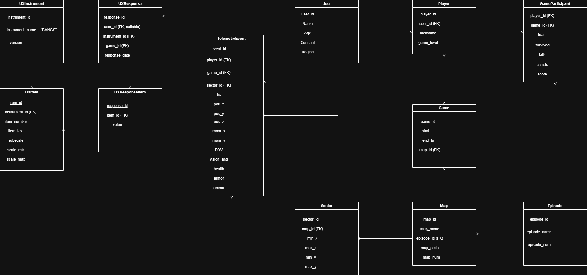

# Chocolate-Doom Telemetry & UX Database

A relational database system designed to store, manage, and analyze gameplay telemetry from a modified version of [Chocolate-Doom](https://github.com/aocalderon/trajectory_doom). Built with PostgreSQL and Python as part of the Database Systems course at Pontificia Universidad Javeriana (Period 2610).

---

## Overview

A research group collects per-tic gameplay data from a hacked Chocolate-Doom build that emits player position (x, y, z), facing angle, momentum vector, FOV, and combat stats (health, armor, ammo) at 35 tics per second. This project designs and prototypes a relational database that:

- Ingests raw TSV telemetry logs through a validated ETL pipeline
- Supports analytical queries for trajectory, proximity, and cooperation analysis
- Integrates UX survey data (BANGS scale) with telemetry for cross-domain analysis
- Enforces data quality, referential integrity, and research ethics (Colombian Law 1581/2012)

---

## Tech Stack

- **PostgreSQL 18** — primary DBMS
- **Python 3.12** — synthetic data generation (`csv`, `math`, `random` stdlib modules)
- **psql** — CLI client for DDL execution and ETL loading

---

## Repository Structure

```
doom_db/
├── sql/
│   ├── 01_schema.sql        # Complete DDL — all CREATE TABLE statements
│   ├── 02_indexes.sql       # Index definitions and evaluation
│   ├── 03_views.sql         # Regular and materialized views
│   ├── 04_queries.sql       # Six analytical queries
│   └── 05_etl.sql           # ETL pipeline — staging to core tables
├── etl/
│   └── generate_data.py     # Synthetic data generator (51,000+ rows)
├── docs/
│   ├── er_diagram.png       # Entity-Relationship diagram
│   ├── schema.md            # Relational schema documentation
│   ├── Data_dictionary.pdf  # Complete data dictionary
│   └── requirements.md      # Domain assumptions, requirements, and ethics
├── report/
│   └── doom_db_report.docx  # Full academic report
├── setup.sh                 # Single-script database recreation
└── README.md
```

---

## Setup & Reproduction

### Prerequisites

- PostgreSQL 18+
- Python 3.8+

### Steps

**1. Clone the repository**
```bash
git clone https://github.com/samuguerraa/doom.git
cd doom
```

**2. Create the database**
```bash
psql -U postgres -c "CREATE DATABASE doom_db;"
```

**3. Run setup script**
```bash
bash setup.sh
```

This will:
- Create all tables with constraints
- Generate synthetic telemetry data
- Load data through the ETL pipeline
- Create indexes and views

---

## Database Schema



The schema consists of 12 normalized tables (3NF) organized in two branches:

**Telemetry branch:** `Episode → Map → Sector → TelemetryEvent ← Game ← GameParticipant ← Player ← User`

**UX branch:** `User → UXResponse → UXResponseItem ← UXItem ← UXInstrument`

---

## Key Design Decisions

- **3NF normalization** across all 12 tables to minimize redundancy and ensure data integrity
- **Staging table pattern** in ETL to isolate raw ingestion from validated core data, with a dedicated error log table for malformed records
- **Materialized view** for trajectory aggregations (`mv_player_traj_stats`) to avoid recomputing LAG window functions on every analytical query
- **Nullable user_id in UXResponse** to support consent revocation — records are anonymized rather than deleted, preserving research data integrity
- **UNIQUE(game_id, player_id, tic)** constraint on TelemetryEvent enables idempotent ETL re-runs without duplicates

---

## Analytical Queries

| # | Query | Technique |
|---|-------|-----------|
| 1 | Average session duration per map | AVG + GROUP BY |
| 2 | Shortest and longest trajectory per player | Window functions (LAG) |
| 3 | UX responses for above-average trajectory players | Subquery + JOIN |
| 4 | Most visited sector per episode and map | COUNT + ORDER BY |
| 5 | Tics where players were together in a sector | Self-join |
| 6 | Total distance and average speed per player | Window functions + aggregation |

---

## Index Evaluation

| Index | Columns | Without Index | With Index | Speedup |
|-------|---------|---------------|------------|---------|
| `idx_tel_game_player_tic` | game_id, player_id, tic | Seq Scan — 50.6ms | Index Scan — 0.16ms | ~309x |
| `idx_tel_sector` | sector_id, game_id | Seq Scan — 17.4ms | Bitmap Index Scan — 0.25ms | ~70x |
| `idx_gp_player_game` | player_id, game_id | Seq Scan — 0.047ms | Seq Scan — 0.042ms | Minimal* |

*`idx_gp_player_game` shows minimal improvement on the 20-row test dataset. Performance gains will materialize as GameParticipant grows to thousands of rows in production.

---

## Known Limitations

- Synthetic data does not replicate real multiplayer session distributions — trajectory patterns are randomized rather than behavior-driven
- ETL pipeline assumes well-formed TSV field count; files with missing columns are rejected entirely rather than partially recovered
- BANGS survey data is synthetic and does not represent statistically valid psychological measurements
- Index evaluation was performed on a 51,000-row dataset; results may differ at production scale

---

## Author

**Samuel Guerra Sánchez**  
samuel_guerra@javeriana.edu.co  
Pontificia Universidad Javeriana  
Database Systems (Bases de Datos) — Period 2610, 2026
